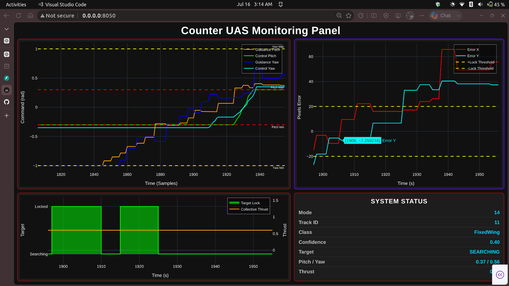
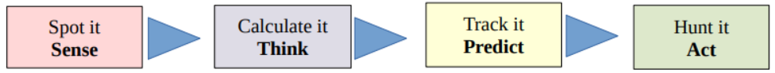
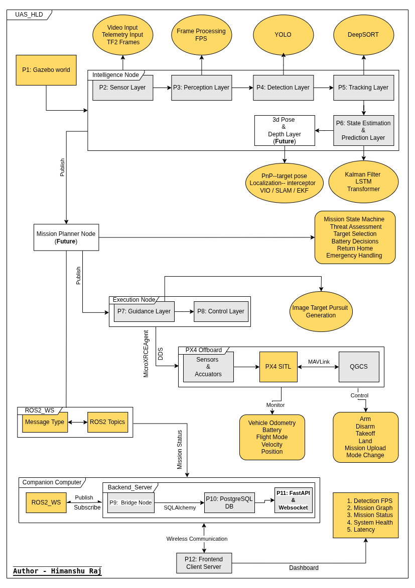

<div align="center">

# Counter-UAS Autonomous Interceptor

Counter-UAS Autonomous Interceptor is a ROS2-based vision-guided autonomous interception system capable of detecting, tracking, estimating, and pursuing an aerial target using onboard visual perception. The system integrates computer vision, state estimation, autonomous guidance, PX4 flight control, a custom air-to-air Gazebo simulation environment, and real-time mission monitoring.


</div>

---

### Testing Sample Visualization

> Integrated tactical visualization showing detection, tracking, state estimation, guidance, target lock, and flight-control information.

<p align="center">
  <video width="900" controls>
    <source src="Couter-UAS_Testing.mp4" type="video/mp4">
    Your browser does not support the video tag.
  </video>
</p>


### Monitoring Dashboard

> Real-time telemetry, guidance, control commands, target lock status, vehicle state, and mission monitoring.

<p align="center">

</p>

---

# Features

- Vision-based aerial target detection using YOLO
- Multi-object tracking using DeepSORT
- Kalman Filter state estimation
- Future target position prediction
- Image-space autonomous guidance generation
- Closed-loop flight-control layer
- PX4 Offboard flight-control interface
- Custom air-to-air Gazebo simulation environment
- Scripted fixed-wing target UAV trajectory
- FPV-style simulated camera system
- Search, tracking, lock, break, and reacquisition scenarios
- Deterministic simulated perception dataset generation
- Tactical ROS2 system visualization
- FastAPI backend with PostgreSQL
- Real-time Plotly Dash monitoring dashboard
- Modular ROS2 architecture
- Unified ROS2 launch infrastructure
- Docker deployment infrastructure
- GitHub Actions CI

---

# Problem Statement

The rapid increase in low-cost unmanned aerial vehicles (UAVs) has introduced significant security challenges across defense installations, airports, critical infrastructure, and restricted airspaces.

Conventional counter-drone systems often depend on radar, GPS, or RF-based detection and mitigation. These approaches may become limited when dealing with autonomous, RF-silent, or GPS-denied aerial systems.

A vision-based autonomous interceptor instead requires its own perception and autonomy stack to detect an aerial target, maintain its identity, estimate its motion, predict its future state, generate pursuit commands, and interface with a flight controller.

Developing such a system requires integrating computer vision, robotics, state estimation, guidance, flight control, simulation, telemetry infrastructure, and real-time monitoring into a modular software architecture.

---

# Solution

This project implements a modular vision-guided Counter-UAS autonomous interceptor architecture covering the complete perception-to-flight-control pipeline.

The system combines YOLO-based object detection, DeepSORT tracking, Kalman Filter state estimation, target-motion prediction, image-space guidance, closed-loop control, and PX4 Offboard integration.

A dedicated Gazebo air-to-air simulation environment provides deterministic visual scenarios using an FPV-style camera and a scripted fixed-wing target UAV. This allows repeatable evaluation of detection, tracking, target lock, evasive break, and reacquisition behavior without depending entirely on external UAV footage.

The project also includes a robotics backend for telemetry persistence and real-time monitoring using FastAPI, PostgreSQL, WebSockets, and Plotly Dash.

The modular ROS2 architecture allows perception, estimation, guidance, control, simulation, visualization, backend, and monitoring components to be developed and tested independently.

<p align="center">


---

# Autonomous System Architecture

<p align="center">

</p>

---

# Technology Stack

| Layer | Technologies |
|--------|--------------|
| Robotics | ROS2 Humble |
| Flight Controller | PX4 SITL, PX4 Offboard |
| Simulation | Gazebo Garden, SDF, Gazebo Transport |
| Computer Vision | OpenCV, YOLO, DeepSORT |
| State Estimation | Kalman Filter |
| Guidance & Control | Image-Space Guidance, Closed-Loop Attitude Control |
| Communication | DDS, MAVLink, PyMAVLink, REST API, WebSockets |
| Backend | FastAPI, SQLAlchemy, PostgreSQL |
| Frontend | Plotly Dash |
| DevOps | Docker, Docker Compose, GitHub Actions |
| Programming Languages | Python, C++ |

---

# Air-to-Air Gazebo Simulation

A dedicated Gazebo subsystem generates controlled air-to-air target-tracking scenarios.

The simulation contains:

- Custom `air_to_air.sdf` world
- Fixed-wing target UAV
- FPV-style observer camera
- Terrain and environmental assets
- Scripted target trajectory generator
- Gazebo Transport camera stream

## Simulation Pipeline

```text
              Gazebo Air-to-Air World
                       │
          ┌────────────┼────────────┐
          ▼            ▼            ▼
     Environment   FPV Camera   Target UAV
                                    │
                                    ▼
                            Trajectory Generator
                                    │
                                    ▼
                        Motion + Position + Attitude
                                    │
                                    ▼
                              Camera Stream
                                    │
                                    ▼
                              Recorded Video
                                    │
                                    ▼
                         ROS2 Autonomy Pipeline
```

- The target UAV uses deterministic scripted kinematic motion rather than an independent PX4 flight controller. 
- This makes the simulation suitable for repeatable perception and autonomy testing. 
- This subsystem is designed for visual perception testing rather than aerodynamic validation of the target aircraft.

---

# Current Capabilities (V1)

- Detect aerial targets from video
- Maintain persistent target identity
- Estimate target position and velocity
- Estimate target acceleration
- Predict short-term target motion
- Calculate image-space tracking error
- Generate autonomous guidance commands
- Generate smooth flight-control setpoints
- Interface with PX4 through Offboard control
- Visualize the complete autonomy pipeline
- Generate deterministic Gazebo air-to-air scenarios
- Simulate fixed-wing evasive target motion
- Exercise SEARCH → TRACK → LOCK transitions
- Exercise LOCK → SEARCH → reacquisition behavior
- Generate simulated air-to-air perception footage
- Stream telemetry to a real-time dashboard
- Store mission telemetry in PostgreSQL
- Launch the complete ROS2 autonomy stack through a unified launch system

---

# Performance Metrics

| Component | Performance |
|-----------|------------:|
| Camera Acquisition | 30 FPS |
| Detection & Tracking (YOLO26m, DeepSORT) | ~14 FPS |
| State Estimation & Guidance Layer | ~5–6 FPS |
| Final Autonomous Pipeline | ~0.5–2.0 FPS |

> **Test Environment:** Ubuntu 22.04, ROS2 Humble, PX4 SITL, Gazebo Garden, CPU-based Intel Core i5 inference.

Performance currently reflects a CPU-only development environment and is not representative of optimized edge-GPU deployment.

---

# Running the Project

## 1. Build ROS2 Workspace

```bash
cd ros2_WS

source /opt/ros/humble/setup.bash

colcon build --symlink-install

source install/setup.bash
```

---

## 2. Start PX4 SITL Simulation

```bash
make px4_sitl gz_x500
```

---

## 3. Start Micro XRCE-DDS Agent

```bash
MicroXRCEAgent udp4 -p 8888
```

---

## 4. Launch QGroundControl

```bash
./QGroundControl.AppImage
```

---

## 5. Launch Robotics & AI Pipeline

```bash
source /opt/ros/humble/setup.bash

source ros2_WS/install/setup.bash

ros2 launch uas_launch uas.launch.py
```

---

## 6. Start PostgreSQL

```bash
sudo systemctl start postgresql
```

---

## 7. Start Backend

```bash
python3 -m backend.main
```

---

## 8. Start Frontend Dashboard

```bash
python3 -m frontend.app
```

---

# Running the Gazebo Simulation

The air-to-air Gazebo environment is a standalone simulation subsystem used to generate deterministic fixed-wing target trajectories and perception footage for the autonomy pipeline.

The simulation requires two primary processes:

```text
Gazebo Air-to-Air World
        │
        ▼
Target Trajectory Generator
        │
        ▼
Scripted Fixed-Wing Motion
        │
        ▼
FPV Camera Stream
        │
        ▼
Optional Video Recording
```

---

## 1. Configure Gazebo Resources

From the project root:

```bash
source gazebo_simulation/air_to_air_tracking/setup_env.sh
```

The resource path should include the custom air-to-air models/worlds and the required PX4 Gazebo resources.

---

## 2. Launch Air-to-Air World

Start the custom Gazebo environment:

```bash
gz sim gazebo_simulation/air_to_air_tracking/worlds/air_to_air.sdf
```

The simulation should load:

```text
Air-to-Air Environment

Fixed-Wing Target UAV

FPV Camera

Terrain and Environment Assets
```

Keep this terminal running.

---

## 3. Verify FPV Camera

Open another terminal and list the available Gazebo topics:

```bash
gz topic -l
gz topic -i -t /air_to_air/fpv_camera/image
```
---

## 4. Run Target Trajectory

Run the compiled trajectory executable:

```bash
cmake ..
make -j$(nproc)

./gazebo_simulation/air_to_air_tracking/trajectory_controller/build/target_trajectory
```

The trajectory generator continuously sends target pose updates to:

```text
/world/air_to_air/set_pose
```

The target should now execute the configured flight sequence:

```text
PATROL
   │
   ▼
DETECTION / TRACKING
   │
   ▼
DEFENSIVE MANEUVER
   │
   ▼
CONVERGENCE
   │
   ▼
LOCK
   │
   ▼
EVASIVE BREAK
   │
   ▼
SEARCH
   │
   ▼
REACQUISITION
   │
   ▼
FINAL LOCK
```

---

## 5. Record Simulation Footage — Optional

Recording is optional and is only required when generating a new perception video for the ROS2 autonomy pipeline.

```bash
./gazebo_simulation/air_to_air_tracking/camera_recorder/build/camera_recorder
```

Start recording after:

```text
Gazebo World              ✓

FPV Camera                ✓

Target Trajectory         ✓
```

Record the FPV camera output for the required trajectory duration.

The final video should use:

```text
Resolution : 1280 × 720

Frame Rate : 30 FPS

Format     : MP4 / MKV
```

The recorded video can then replace the existing perception input:

```text
Gazebo FPV Camera
        │
        ▼
Recorded Air-to-Air Video
        │
        ▼
drone_video.mp4 /mkv
        │
        ▼
ROS2 Autonomy Pipeline
```

Recording does not affect the Gazebo trajectory itself and can be omitted when only testing the simulated target motion.

---

# DevOps Infrastructure

### Implemented in V1

- Docker infrastructure
- Docker Compose
- Environment configuration
- Dependency management
- GitHub Actions Continuous Integration

### Planned

- Full ROS2 containerization
- Continuous Delivery
- NVIDIA Jetson deployment
- GPU-accelerated inference
- GitHub Container Registry

---

# Future Roadmap

### V1 — Vision-Based Autonomous Interceptor

- Perception pipeline ✅
- State estimation ✅
- Guidance and control ✅
- PX4 Offboard integration ✅
- Gazebo air-to-air simulation ✅
- Backend and dashboard ✅

### V2 — 3D Target Localization

- Stereo Vision
- Monocular Depth Estimation
- World-frame Target Localization
- Relative 3D State Estimation
- 3D Intercept Geometry

### V3 — GPS-Denied Autonomous Navigation

- Visual-Inertial Odometry
- SLAM
- Sensor Fusion
- Local Navigation
- Edge deployment

### V4 — Advanced Autonomous Mission Architecture

- Multi-target tracking
- Mission planning
- Multi-UAV coordination
- Autonomous search
- Advanced simulation and hardware validation

---

# Documentation

Detailed implementation documentation is available in the [**Docs directory**](docs/).

Documentation & Development Phases covers:

| Phase | Module | Status |
|--------|--------|:------:|
| P1 | ROS2 + PX4 Integration | ✅ |
| P2 | Camera Integration | ✅ |
| P3 | Object Detection | ✅ |
| P4 | Multi-Object Tracking | ✅ |
| P5 | State Estimation | ✅ |
| P6 | Guidance | ✅ |
| P7 | Flight Control | ✅ |
| P8 | Backend Services | ✅ |
| P9 | System Visualization & Launch | ✅ |
| P10 | Dashboard & Real-Time Monitoring | ✅ |
| P11 | DevOps & CI | ✅ |
| P12 | Documentation | ✅ |
| P13 | Gazebo Virtual World Simulation | ✅ |

---
---

# Project Scope

The current V1 system demonstrates the software architecture and simulation workflow required for vision-based autonomous UAV target tracking and pursuit.

The current implementation uses:

- 2D image-space target measurements
- Simulated PX4 flight control
- Scripted Gazebo target motion
- Prerecorded/simulated visual input
- CPU-based perception inference

Full real-world interception requires additional capabilities including calibrated 3D localization, sensor fusion, relative navigation, flight-envelope validation, hardware-in-the-loop testing, and real-world flight validation.

---

# License

This project is licensed under the **Counter-UAS Research & Demonstration License v1.0**.

The source code is available for:

- Personal learning
- Academic research
- Educational use
- Non-commercial demonstrations

Commercial use, production deployment, redistribution for commercial purposes, or monetization of this project requires prior written permission from the copyright holder.

### See the [LICENSE](LICENSE) file for the complete license terms.

---

# Author - Himanshu Raj

- LinkedIN: https://www.linkedin.com/in/raj04h
- Email: himanshuraj.hr9934@gmail.com

<div align="center">

**Counter-UAS Autonomous Interceptor**

*An end-to-end vision-based autonomous UAV tracking and pursuit system integrating ROS2, PX4, computer vision, Gazebo simulation, flight control, and real-time monitoring.*

</div>
