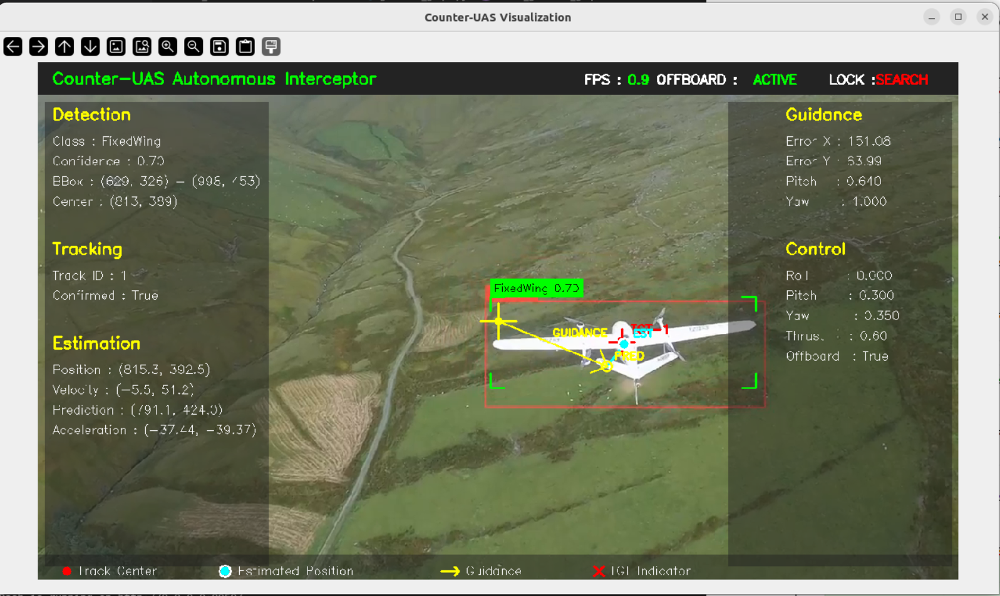

<div align="center">

# Counter-UAS Autonomous Interceptor

Counter-UAS Autonomous Interceptor is a modular vision-based autonomous interception system capable of detecting, tracking, estimating, and pursuing an aerial target using only onboard visual perception. Unlike GPS-based pursuit systems, the interceptor relies entirely on camera observations, target state estimation, and autonomous guidance commands.


</div>

---

### Visualization

> Integrated visualization showing detection, tracking, estimation, guidance, and control overlays.

<p align="center">

</p>

### Monitoring Dashboard

> Real-time telemetry, guidance, control commands, target lock status, and mission monitoring.

<p align="center">

</p>

---

# Features

- Vision-based target detection using YOLO
- Multi-object tracking using DeepSORT
- Kalman Filter state estimation
- Future target prediction
- Autonomous guidance generation
- PX4 Offboard flight control
- FastAPI backend with PostgreSQL
- Real-time Plotly Dash monitoring dashboard
- Modular ROS2 architecture
- GitHub Actions CI
- Docker-ready deployment infrastructure

---

# Problem Statement

The rapid increase in low-cost unmanned aerial vehicles (UAVs) has introduced significant security challenges across defense installations, airports, critical infrastructure, and restricted airspaces. Conventional counter-drone solutions often depend on radar, GPS, or RF jamming, which can be ineffective against autonomous or GPS-denied drones.

An autonomous interceptor must instead rely on its own onboard perception to identify, track, predict, and pursue an unknown aerial target without receiving any information from the target itself.

Developing such a system requires integrating computer vision, robotics, autonomous guidance, flight control, and real-time communication into a single reliable software architecture capable of operating in dynamic environments.

---

# Solution

This project presents a modular vision-based Counter-UAS autonomous interception system that performs the complete perception-to-control pipeline using onboard sensing.

The system combines modern computer vision, robotics, and autonomous control techniques to detect an aerial target, maintain persistent tracking, estimate its motion, predict its future position, and generate guidance commands for autonomous pursuit through PX4 Offboard control.

In addition to the autonomous robotics pipeline, the project includes a complete backend infrastructure for telemetry storage, real-time monitoring, and system visualization using FastAPI, PostgreSQL, WebSockets, and a Plotly Dash dashboard.

The modular ROS2 architecture enables each subsystem to be developed, tested, and deployed independently while supporting future expansion toward edge deployment, GPS-denied navigation, and multi-target autonomous interception.

---

# System Architecture

<p align="center">

</p>

---

# Technology Stack

| Layer | Technologies |
|--------|--------------|
| Robotics | ROS2 Humble, PX4 SITL, Gazebo Garden |
| Computer Vision | OpenCV, YOLO, DeepSORT |
| State Estimation | Kalman Filter |
| Communication | MAVLink, PyMAVLink, REST API, WebSockets |
| Backend | FastAPI, SQLAlchemy, PostgreSQL |
| Frontend | Plotly Dash |
| DevOps | Docker, Docker Compose, GitHub Actions |
| Programming Languages | Python, C++ |
---

# Development Phases

| Phase | Module | Status |
|--------|--------|:------:|
| P1 | ROS2 + PX4 Integration | ✅ |
| P2 | Camera Integration | ✅ |
| P3 | Object Detection | ✅ |
| P4 | Multi-Object Tracking | ✅ |
| P5 | State Estimation | ✅ |
| P6 | Guidance | ✅ |
| P7 | Flight Control | ✅ |
| P8 | Backend Services | ✅ |
| P9 | Dashboard | ✅ |
| P10 | Integration Testing | ✅ |
| P11 | DevOps & CI | ✅ |
| P12 | Documentation | ✅ |

---

# Current Capabilities (V1)

- Detect aerial targets in video streams
- Maintain persistent target identity
- Estimate target position and velocity
- Predict short-term target motion
- Generate autonomous guidance commands
- Interface with PX4 Offboard Control
- Stream telemetry to a real-time dashboard
- Store mission telemetry in PostgreSQL

---

# Performance Metrics

| Component | Performance |
|-----------|------------:|
| Camera Acquisition | 30 FPS |
| Detection & Tracking (YOLO26m, DeepSORT) | 14 FPS |
| State Estimation & Guidance Layer (KalmanFilter) | 5-6 FPS |
| Final Autonomous Pipeline | 2–3 FPS |

> **Test Environment:** Ubuntu 22.04, ROS2 Humble, PX4 SITL, Gazebo Garden, CPU (Intel i5)-based inference.

---

# Running the Project

## 1. Start PX4 SITL Simulation

```bash
make px4_sitl gz_x500
```

## 2. Start Micro XRCE-DDS Agent

```bash
MicroXRCEAgent udp4 -p 8888
```

## 3. Launch QGroundControl Station

```bash
./QGroundControl.AppImage
```

## 4. Launch Robotics & AI Pipeline

```bash
source /opt/ros/humble/setup.bash
source ros2_WS/install/setup.bash

ros2 launch uas_launch uas.launch.py
```

## 5. Start Database Server

```bash
sudo systemctl start postgresql
```

## 6. Start Backend Server

```bash
python3 -m backend.main
```

## 7. Start Frontend Server

```bash
python3 -m frontend.app
```

---

# DevOps Infrastructure

Implemented in V1

- Docker Infrastructure
- Docker Compose
- Environment Configuration
- GitHub Actions Continuous Integration

Planned

- Full ROS2 Containerization
- Continuous Delivery (CD)
- Edge Deployment (Jetson)
- GitHub Container Registry

---

# Future Roadmap

### V1
* Vision-Based Autonomous Interceptor ✅

### V2
* 3D Target Localization
* Stereo Vision
* Depth Estimation

### V3
* GPS-Denied Navigation
* SLAM
* Visual-Inertial Odometry

### V4
* Multi-Target Counter-UAS Platform
* Swarm Interception
* Mission Planning

---

# Documentation

Detailed implementation documents are available in the [docs](docs/) directory, covering every development phase from system architecture to deployment.

---

# License 

This project is licensed under the **Counter-UAS Research & Demonstration License v1.0**.

The source code is available for:

- Personal learning
- Academic research
- Educational use
- Non-commercial demonstrations

Commercial use, production deployment, redistribution for commercial purposes, or monetization of this project requires prior written permission from the copyright holder.

See the [LICENSE](LICENSE) file for the complete license terms.
---

# Author - Himanshu Raj

- LinkedIn: https://www.linkedin.com/in/raj04h
- Email: himanshuraj.hr9934@gmail.com

<div align="center">

**Counter-UAS Autonomous Interceptor**

*An end-to-end vision-based autonomous interception system built with ROS2, PX4, Computer Vision, and modern backend infrastructure.*

</div>
